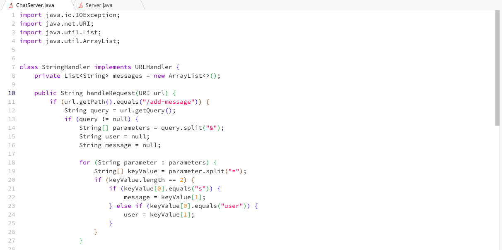
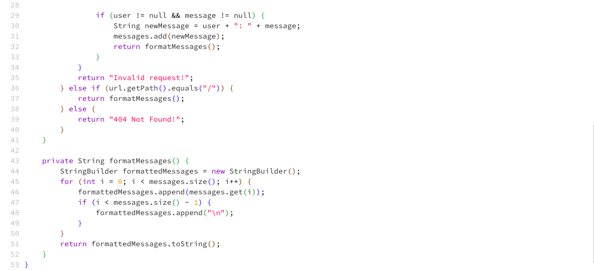
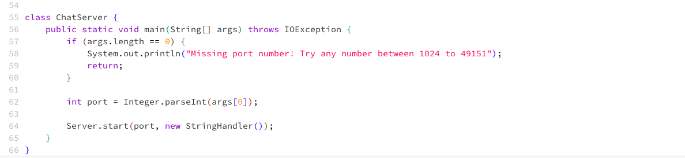
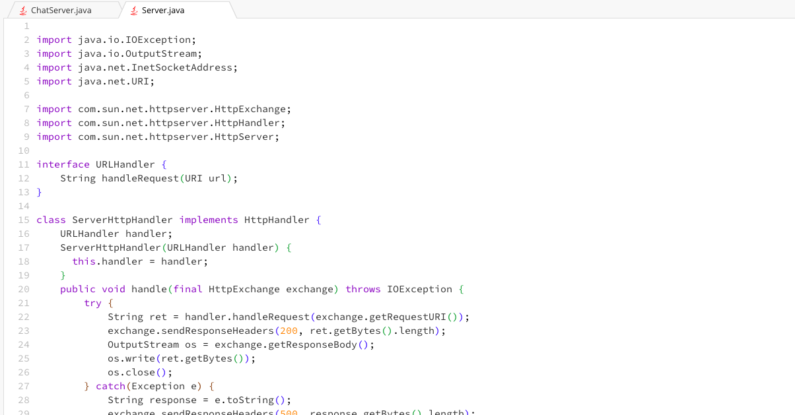
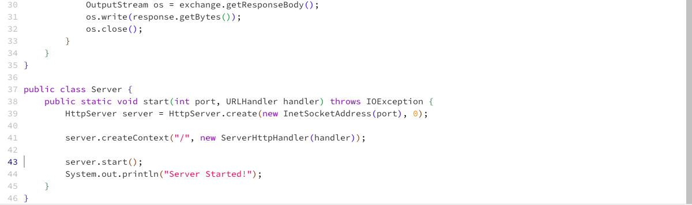
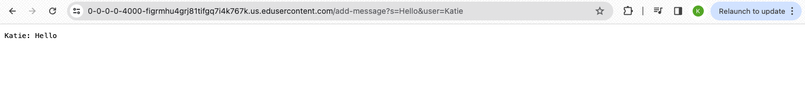
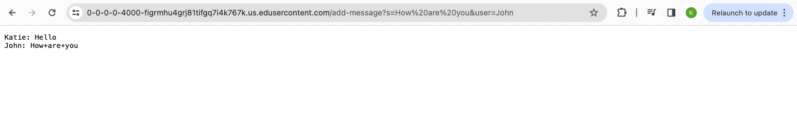

# Lab 2 Report: Khushi Kumra 
CSE 15L
## Part 1
### ChatServer Code

### Server Code

### AddMessage screenshots

- Method Called
  - The handleRequest method in StringHandler is called.
- Relevant Arguments
  - The URI is "/add-message". The query parameters are "s=Hello" and "user=Katie".
- Relevant Field Values
  - The messages list is updated to include a new message: "Katie: Hello"

- Method Called
  - The handleRequest method in StringHandler is called.
- Relevant Arguments
  - The URI is "/add-message". The query parameters are "s=How%20are%20you" and "user=Kelly".
- Relevant Field Values
  - The messages list is updated to include a new message: "Kelly: How are you"

## Part 2
### 

## Part 3

I learned how to build and run a server using Java, gained an understanding of web server development and how to handle HTTP requests. Furthermore, I learned how to use SSH and set up a server on my computer, acquiring the ability to remotely access my computer and configure it as a server, a valuable skill for managing remote systems and services.

