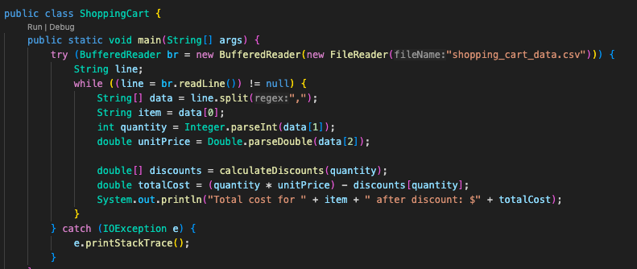
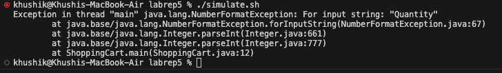
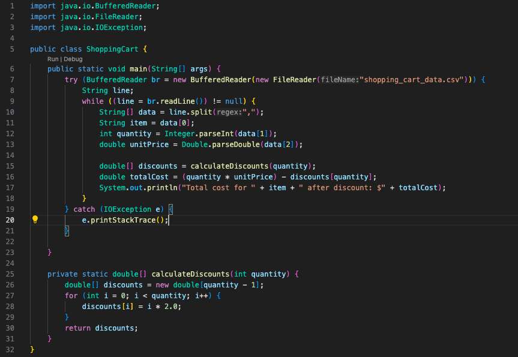
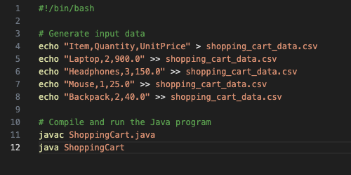
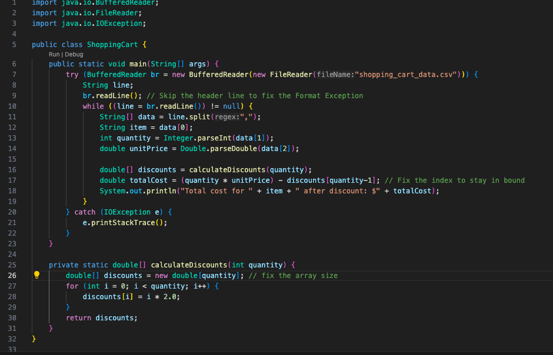
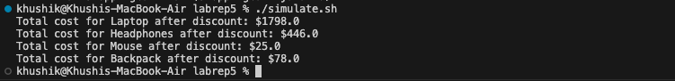

# Lab 5 Report: Khushi Kumra 
CSE 15L

## Step 1 - Student Post

Subject: Help! Number Format Exception in Program

Hey everyone, I'm currently working on a shopping cart program in Java, and I've run into a puzzling issue. In my recent output, I'm getting a NumberFormatException, and I'm trying to make sense of what might be causing it.

The program reads data from a CSV file containing item names, quantities, and unit prices, then calculates the total cost after applying a discount. However, the terminal is showing an error related to number formatting. I suspect there might be an issue with how the program interprets the quantity or unit price. Any insights into what might be going wrong would be greatly appreciated!

## Step 2 - TA Response

Subject: Re: Help! Number Format Exception in Program

Hi there! Thanks for reaching out. It looks like your program might be encountering an issue with the data parsing. According to the error message, take a look at line 12 when the integers get parsed into quantity. Follow this variable and make sure the values stay consistent. Additionally, based on the error message, there might be an issue in the while loop? Keep in mind the loop regards throwing an exception - you may need to find a way to deal with that. 

## Step 3 - Student Result + Bug Description

Description of Bug:

There were two initial bugs in the program. Firstly, a NumberFormatException arose due to the attempt to parse the "Quantity" string from the CSV header as an integer during data processing in the main method. Secondly, an ArrayIndexOutOfBoundsException occurred in the calculateDiscounts method when creating an array with a size of quantity - 1 and subsequently trying to access an element at index quantity in the main method. 

## Step 4 - Information

File & Directory Structure:

- ShoppingCart.java (Java file)
- simulation.sh (Bash script)

Contents of Each File Before Fixing the Bug:

ShoppingCart.java before fixing the bug:

simulation.sh:

Full Command Line to Trigger the Bug:

Description of Bug Fix:

The NumberFormat Exception was addressed by introducing a line to skip the header before entering the data processing loop. To resolve the IndexOutofBounds Exception, the array size was adjusted to quantity in the calculateDiscounts method, and the index was appropriately adjusted when accessing the array in the main method. These modifications collectively rectified the parsing and indexing errors, ensuring the proper execution of the shopping cart simulation.

## Part 2 - Reflection

During the second half of this quarter, I delved into the world of bash scripting and learned how to create and execute .sh files. This  skill allowed me to automate repetitive tasks, enhance workflow efficiency, and gain a deeper understanding of command-line operations. As a result, I've successfully streamlined various facets of my lab work, allowing for more efficient and precise execution of tasks. I was really able to understand how simple it makes executing command-line operations when completing this lab report; the bash script saved a couple lines in the terminal every time I had to test the program or run it. 
