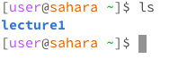
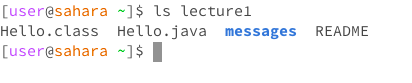
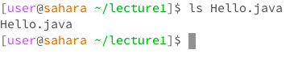

# Lab 1 Report: Khushi Kumra 
CSE 15L, Section 
## cat command
**Using command with no arguments**

The working directory here was home. There is no output here with no arguments because the cat command is meant to look for a file/directory and it can't find one because we haven't given it an argument, or in other words, something to find. 

**Using command w/ path to directory as argument**

The working directory here was still home. The output was lecture1 is a directory because we gave cat the argument of a directory not a file, so the output explains that cat, like it normally would given a file, can't display the contents because lecture1 is a directory, not a file. 

**Using command w/ path to file as argument**

Here, te working directory is still home. We used a path to direct cat to a specific file, in this case Hello.java. Because we directed it to Hello.java, which is a file, cat was able to display its contents, hence the output of the code contained in Hello.java.

## cd command
**Using command with no arguments**

The working directory is home. cd takes us to the home directory of the user, which in this case, is just home because we haven't provided it with any arguments.

**Using command w/ path to directory as argument**

The working directory is lecture 1. cd outputs the contents of the directory messages within lecture 1 because that's the path we provided as an argument. In this case, messages contains some text files, which is what cd tells us in the output.

**Using command w/ path to file as argument**

The working directory is lecture1. We gave cd the argument of a file, which it is not meant to use. cd is meant to change the working directory, and a file is not a working directory therefore the output explains that Hello.java is not a directory and just a file.

## ls command
**Using command with no arguments**

The working directory is home. ls with no arguments outputs the contents of the current working directory which is what we see here. Because our current working directory is home, that just means lecture 1. 

**Using command w/ path to directory as argument**

The working directory is still home. ls with the path to the lecture1 directory now outputs the contents of this directory, so in this case the contents of lecture1. 

**Using command/ path to file as argument**

The working directory is lecture1 here. ls with the input of Hello.java, or a file, just gives us information about the file, or in this case, just it's name. 
