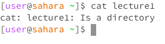
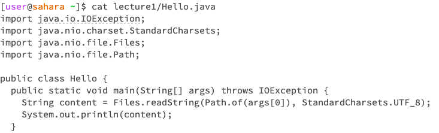
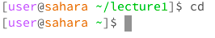
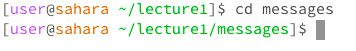
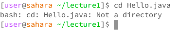

# Lab 1 Report: Khushi Kumra 
CSE 15L, Section | *explain why what's being printed is being printed for each part*
## cat command
**Using command with no arguments**

**Using command w/ path to directory as argument**

**Using command/ path to file as argument**

## cd command
**Using command with no arguments**

**Using command w/ path to directory as argument**

**Using command/ path to file as argument**

