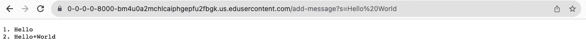

# Lab 2 Report: Khushi Kumra 
CSE 15L
## Part 1
### StringServer Code

The working directory here was home. There is no output here with no arguments because the cat command is meant to look for a file/directory and it can't find one because we haven't given it an argument, or in other words, something to find. Not an error.

### AddMessage screenshots

## Part 2
### 

## Part 3

I learned how to build and run a server using Java, gained an understanding of web server development and how to handle HTTP requests. Furthermore, I learned how to use SSH and set up a server on my computer, acquiring the ability to remotely access my computer and configure it as a server, a valuable skill for managing remote systems and services.

