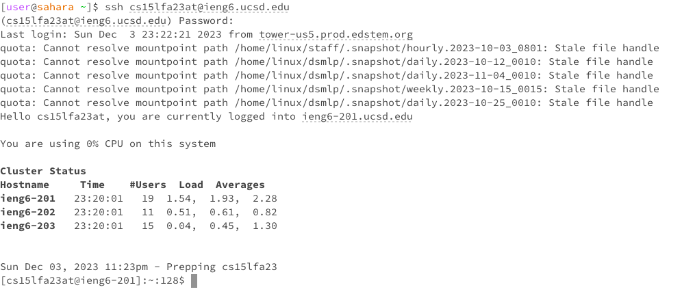
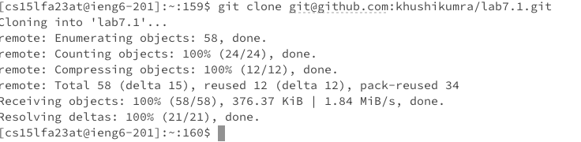
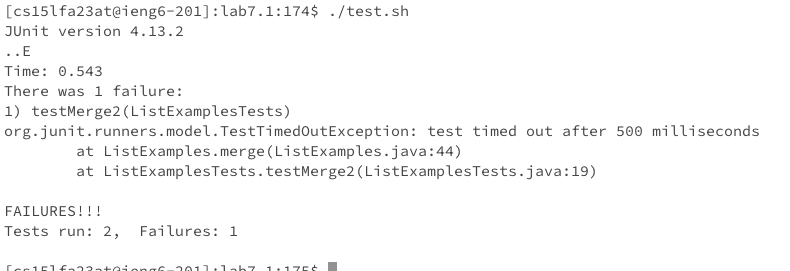
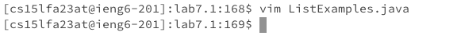
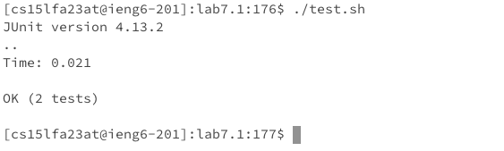
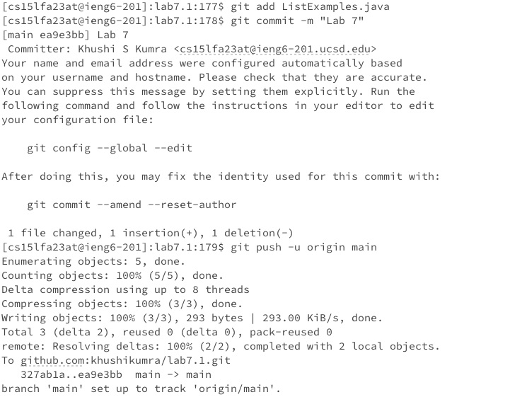

# Lab 4 Report: Khushi Kumra 
CSE 15L
## Step 4

**Keys Pressed**

ssh cs15lfa23at@ieng6.ucsd.edu&lt;enter&gt;(password)&lt;enter&gt;

**Summary**

I logged in to my ieng6 account.

## Step 5

**Keys Pressed**

git clone git@github.com:khushikumra/lab7.1.git&lt;enter&gt;

**Summary**

The lab7 file was git cloned into my home directory on EdStem. I had to save it as 7.1 because I had already cloned lab7 into EdStem, so I changed the newly forked repository name. 

## Step 6

**Keys Pressed**

./test.sh &lt;enter&gt;

**Commands and Effects Summary** 

I ran the bash script, test.sh to see the tests fail.  

## Step 7

**Keys Pressed**

vim ListExamples.java &lt;enter&gt; 42(j) 11(l) i2 &lt;esc&gt; l dl :wq &lt;enter&gt;

**Commands and Effects Summary**
I used vim to edit ListExample.java, and used the vim commands to move the cursor to the final loop in merge, used the vim commands to move the cursor over index1 to change index1 to index2 in the final merge loop to increment index2. 

## Step 8

**Keys Pressed**
./test.sh &lt;enter&gt;

**Commands and Effects Summary**

I ran the bash script, test.sh to see the tests succeed, which they did as seen.  

## Step 9

**Keys Pressed**
git add ListExamples.java &lt;enter&gt;
git commit -m "Lab7" &lt;enter&gt;
git push -u origin main &lt;enter&gt;
git push &lt;enter&gt;

**Commands and Effects Summary**

I committed and pushed the resulting change to your Github account

**Commands and Effects Summary**

went up three time o access javac -cp command. went up another three times to acces java -cp command
