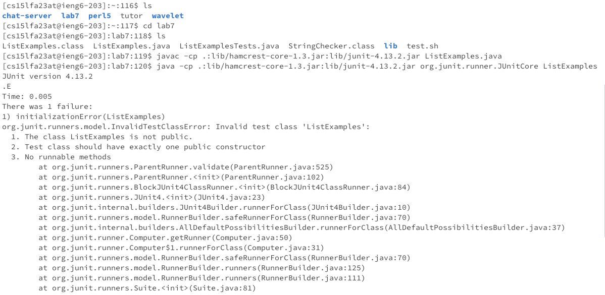
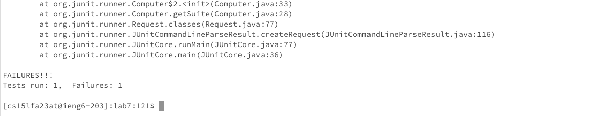

# Lab 4 Report: Khushi Kumra 
CSE 15L
## Step 4

**Keys Pressed**

ssh cs15lfa23at@ieng6.ucsd.edu&lt;enter&gt;(password)&lt;enter&gt;

**Summary**

I logged in to my ieng6 account.

## Step 5

**Keys Pressed**

git clone git@github.com:khushikumra/lab7.git&lt;enter&gt;

**Summary**

The lab7 file was already git cloned into the workspace so it showed up as an existing directory in the terminal.

## Step 6

**Keys Pressed**

ls &lt;enter&gt; cd lab7 &lt;enter&gt; ls &lt;enter&gt; javac -cp .:lib/hamcrest-core-1.3.jar:lib/junit-4.13.2.jar ListExamples.java &lt;enter&gt; java -cp .:lib/hamcrest-core-1.3.jar:lib/junit-4.13.2.jar org.junit.runner.JUnitCore ListExamples &lt;enter&gt;

**Commands and Effects Summary** 

I cd'd into the lab7 repository, used ls to check the files in the repository, and 
then ran ListExamples.java with the JUnit tests to see why the file fails. 

## Step 7

**Keys Pressed**

vim ListExamples.java &lt;enter&gt; 42(j) 11(l) i2 &lt;esc&gt; l dl :wq &lt;enter&gt;

**Commands and Effects Summary**

## Step 8

**Keys Pressed**
vim ListExamples.java 

**Commands and Effects Summary**

## Step 9

**Keys Pressed**
&lt;up&gt; &lt;up&gt; &lt;up&gt; &lt;enter&gt; &lt;up&gt; &lt;up&gt; &lt;up&gt; &lt;enter&gt; 

**Commands and Effects Summary**

went up three time o access javac -cp command. went up another three times to acces java -cp command
