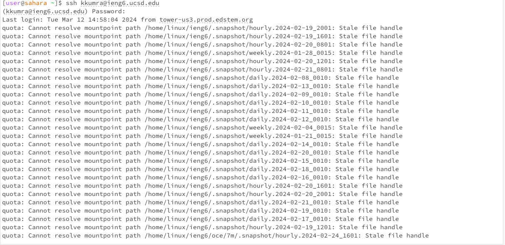
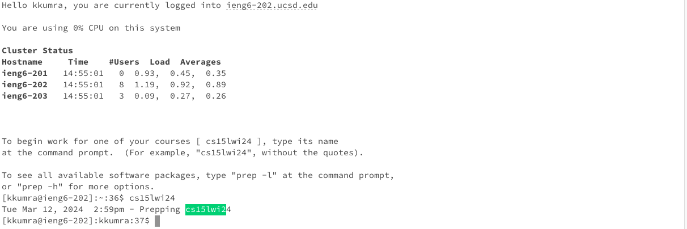
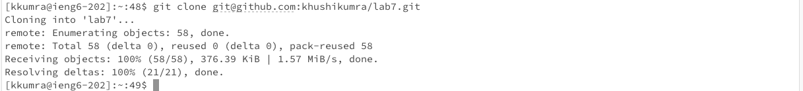
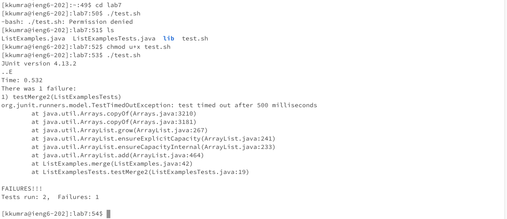
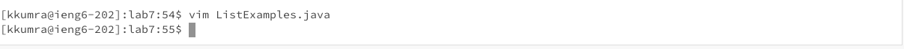
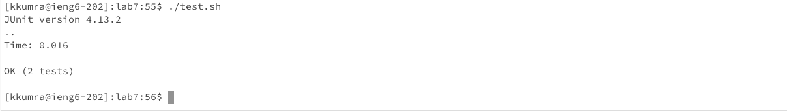
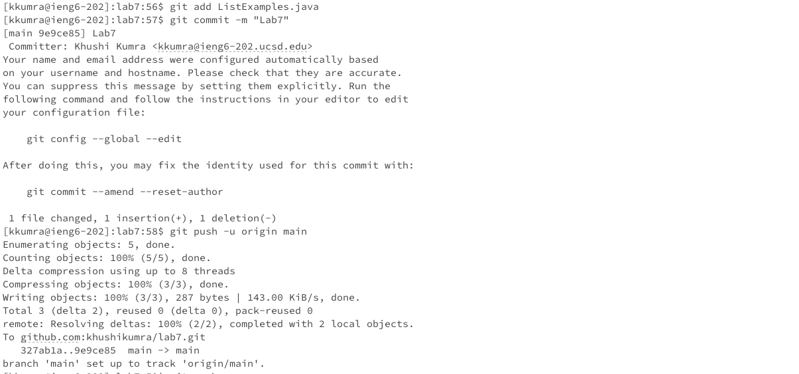

# Lab 4 Report: Khushi Kumra 
CSE 15L
## Step 4

**Keys Pressed**

ssh kkumra@ieng6.ucsd.edu&lt;enter&gt;(password)&lt;enter&gt;cs15lwi24&lt;enter&gt;

**Summary**

I logged in to my ieng6 account and started work for this class.

## Step 5

**Keys Pressed**

git clone git@github.com:khushikumra/lab7.1.git&lt;enter&gt;

**Summary**

I git cloned the lab 7 repository that I forked on my github into the workspace to import lab7. 

## Step 6

**Keys Pressed**

cd lab7 &lt;enter&gt; ./test.sh &lt;enter&gt; ls&lt;enter&gt; chmod u+x test.sh&lt;enter&gt;  ./test.sh &lt;enter&gt;

**Commands and Effects Summary** 

I first cd'd into the lab7 directory, and from there I tried running the bash script, test.sh. 
The file originally denied me permission to run the tests, so I debugged that by first using ls to ensure test.sh exists in the directory, then I ran the chmod command to change the permission of the file and give me permission to run the script. Then, I ran the bash script test.sh again to see that the tests fail. 

## Step 7

**Keys Pressed**

vim ListExamples.java &lt;enter&gt; 43(j) 11(l) i2 &lt;esc&gt; l dl :wq &lt;enter&gt;

**Commands and Effects Summary**
I used vim to edit ListExample.java, and used the vim commands to move the cursor to the final loop in merge, used the vim commands to move the cursor over index1 to change index1 to index2 in the final merge loop to increment index2. Then I exited out of vim. 

## Step 8

**Keys Pressed**
./test.sh &lt;enter&gt;

**Commands and Effects Summary**

I ran the bash script, test.sh to see the tests succeed, which they did as seen.  

## Step 9

**Keys Pressed**
git add ListExamples.java &lt;enter&gt;
git commit -m "Lab7" &lt;enter&gt;
git push -u origin main &lt;enter&gt;
git push &lt;enter&gt;

**Commands and Effects Summary**

I committed and pushed the resulting change to my Github account. 
