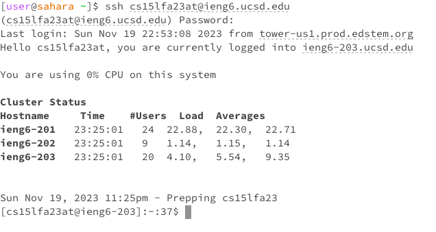
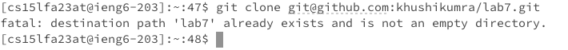

# Lab 4 Report: Khushi Kumra 
CSE 15L
## Step 4

**Keys Pressed**
ssh cs15lfa23at@ieng6.ucsd.edu&lt;enter&gt;
(password)&lt;enter&gt;

**Summary**
I logged in to my ieng6 account.

## Step 5

**Keys Pressed**
git clone git@github.com:khushikumra/lab7.git&lt;enter&gt;

**Summary**
The lab7 file was already git cloned into the workspace so it showed up as an existing directory in the terminal.

## Step 6

**Keys Pressed**
The working directory here was home. There is no output here with no arguments because the cat command is meant to look for a file/directory and it can't find one because we haven't given it an argument, or in other words, something to find. Not an error.

**Commands and Effects Summary**

## Step 7

**Keys Pressed**
The working directory here was home. There is no output here with no arguments because the cat command is meant to look for a file/directory and it can't find one because we haven't given it an argument, or in other words, something to find. Not an error.

**Commands and Effects Summary**

## Step 8

**Keys Pressed**
The working directory here was home. There is no output here with no arguments because the cat command is meant to look for a file/directory and it can't find one because we haven't given it an argument, or in other words, something to find. Not an error.

**Commands and Effects Summary**

## Step 9

**Keys Pressed**
The working directory here was home. There is no output here with no arguments because the cat command is meant to look for a file/directory and it can't find one because we haven't given it an argument, or in other words, something to find. Not an error.

**Commands and Effects Summary**

