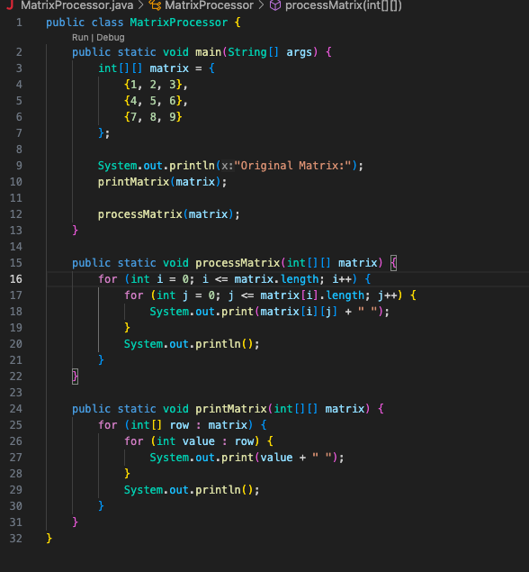
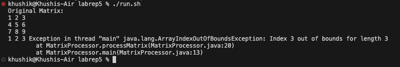
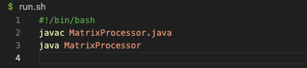
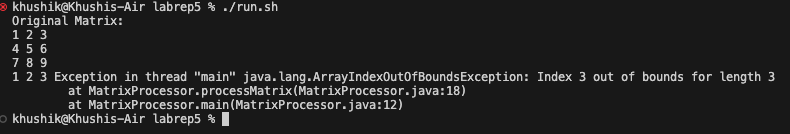
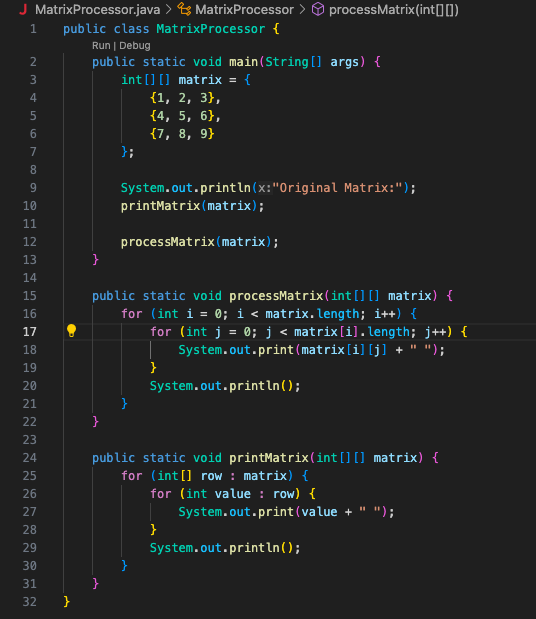
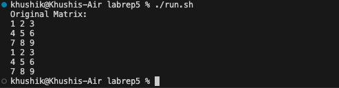

# Lab 5 Report: Khushi Kumra 
CSE 15L
## Step 1 - Student Post

Subject: Help! Unexpected Error in Matrix Processing

Hey everyone, I'm encountering a strange error in my Java program that deals with matrix processing. I've attached a screenshot below to show the issue.

The program is supposed to process a matrix and display the elements. However, I'm getting an error that I can't quite figure out. I suspect it has something to do with how I'm iterating through the matrix. Any suggestions on what might be causing this?

## Step 2 - TA Response

Subject: Re: Help! Unexpected Error in Matrix Processing

Hey there! Thanks for reaching out. The error could be related to how you're iterating through the matrix. Maybe something about the loop conditions? Can you run the bash script and provide what the error message says?

## Step 3 - Student Result + Bug Description

Description of Bug:

The program generates an ArrayIndexOutOfBoundsException when attempting to access an out-of-bounds index in the processMatrix method. This error is caused by the loop conditions using <= instead of <, leading to an attempt to access the nonexistent fourth row and fourth column in a 3x3 matrix.

## Step 4 - Information

File & Directory Structure:

- MatrixProcessor.java (Java file)
- run.sh (Bash script)
Contents of Each File Before Fixing the Bug:

MatrixProcessor.java before fixing the bug:

run.sh:

Full Command Line to Trigger the Bug:

Description of Bug Fix:

In the processMatrix method of MatrixProcessor.java, you have to update the loop conditions to use < instead of <= to prevent accessing out-of-bounds indices:

## Part 2 - Reflection

During the second half of this quarter, I delved into the world of bash scripting and learned how to create and execute .sh files. This  skill allowed me to automate repetitive tasks, enhance workflow efficiency, and gain a deeper understanding of command-line operations. As a result, I've successfully streamlined various facets of my lab work, allowing for more efficient and precise execution of tasks. I was really able to understand how simple it makes executing command-line operations when completing this lab report; the bash script saved a couple lines in the terminal every time I had to test the program or run it. 
